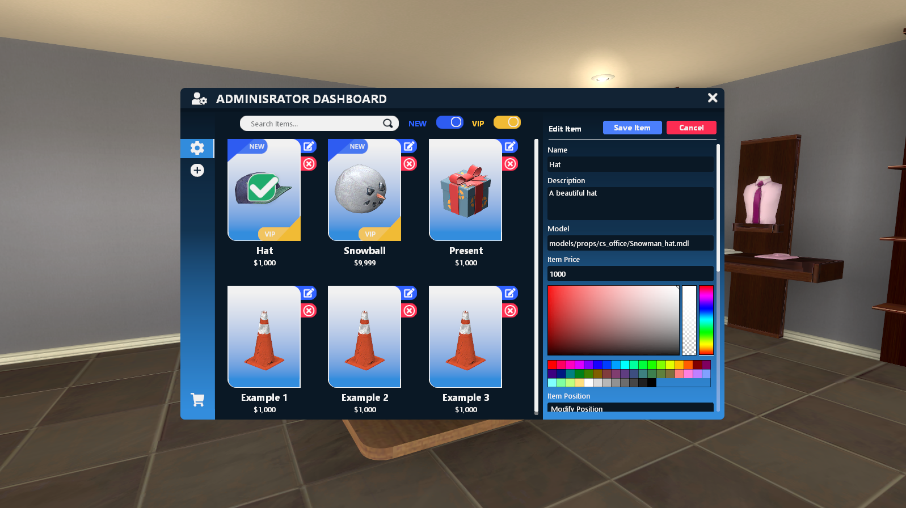
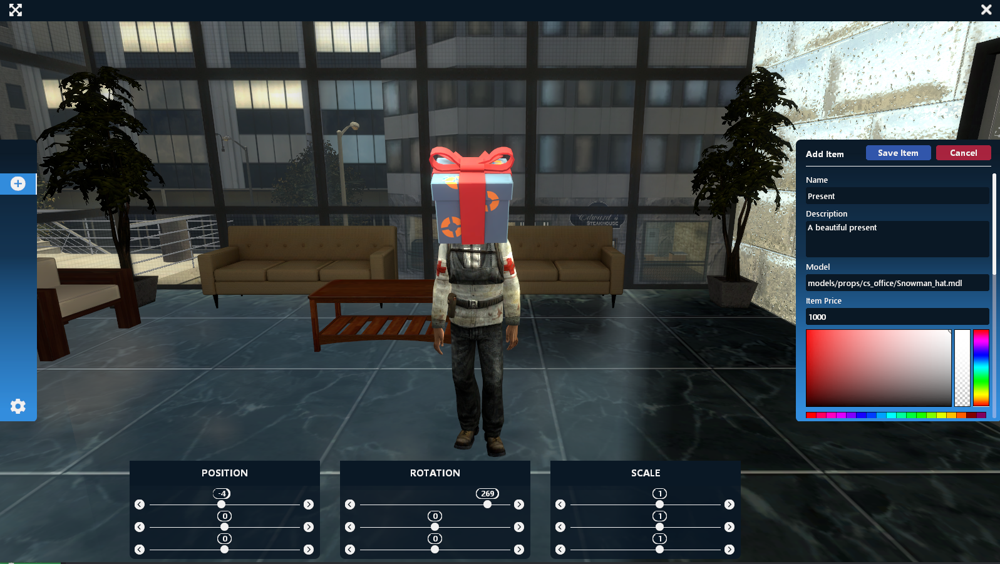

# Admin

## AAS.AdminSetting\(\)

Open the admin setting menu

Output:

## AAS.PositionSettings\(itemTable\)

Open the position settings menu

| Types | Arguments | Descriptions | Optional |
| :--- | :--- | :--- | :--- |
| [itemTable](../structs/item-table.md) | **itemTable** | The itemTable where you want to change the positions | ❌ |

Output:

