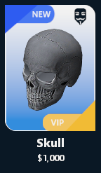

# AAS:Cards

## PANEL:RemoveButton\(\)

Delete the buttons at the right of the card

## PANEL:AddItemView\(itemScroll, accessoriesFrame, itemContainer, tbl\)

Setup the card model, and add some informations on it

| Types | Arguments | Descriptions | Optional |  |
| :--- | :--- | :--- | :--- | :--- |
| [Panel](https://wiki.facepunch.com/gmod/Panel) | **itemScroll** | The card linked scroll | ❌ |  |
| [Panel](https://wiki.facepunch.com/gmod/Panel) | **accessoriesFrame** | The card linked frame | ❌ |  |
| [Panel](https://wiki.facepunch.com/gmod/Panel) | **itemContainer** | The card linked container \(like a | \[[DIconLayout](https://wiki.facepunch.com/gmod/DIconLayout)\) | ❌ |
| [itemTable](../structs/item-table.md) | **tbl** | The card linked item | ❌ |  |

Example:

```lua
local card = vgui.Create("AAS:Cards", accessoriesFrame)
card:AddItemView(scroll, accessoriesFrame, iconLayout, AAS.GetTableById(1))
```

Output:



