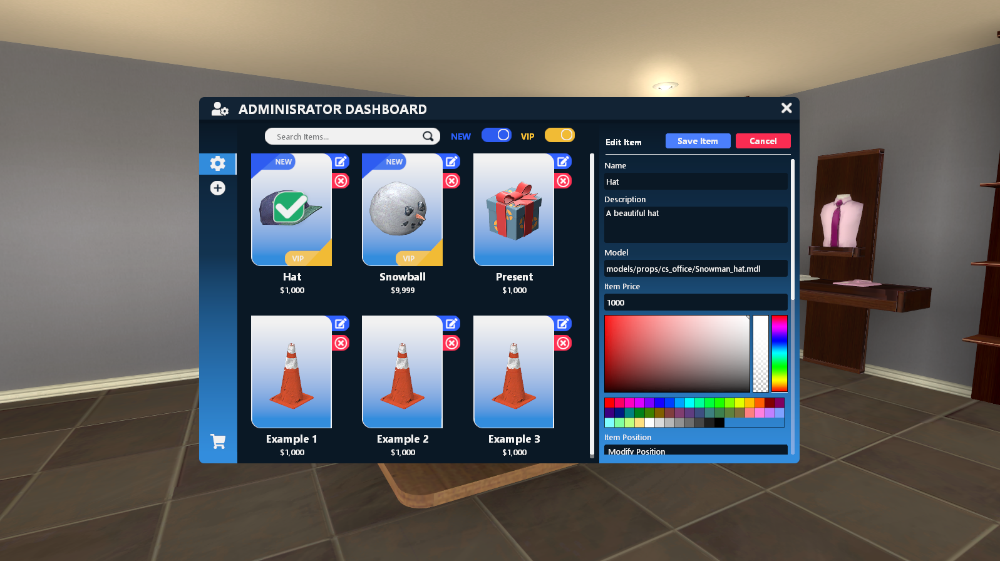

# Admin UI Functions

### AAS.AdminSetting()
Open the admin setting menu

### AAS.PositionSettings(itemTable)
Open the position settings menu 

| Types | Arguments | Descriptions |
| :--- | :--- | :--- |
| table | [itemTable](../../data/itemTable.md) | The itemTable where you want to change the positions |

