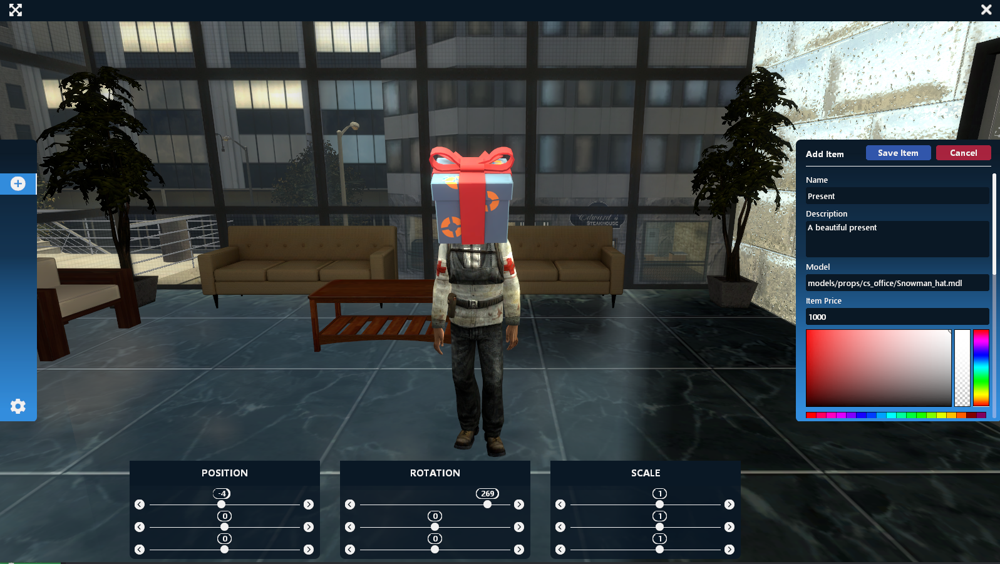

# Admin UI Functions

### AAS.AdminSetting()
Open the admin setting menu

Output:

### AAS.PositionSettings(itemTable)
Open the position settings menu 

| Types | Arguments | Descriptions | Optional |
| :--- | :--- | :--- | :--- |
| [table](https://www.lua.org/pil/2.5.html) | [itemTable](../../data/itemTable.md) | The itemTable where you want to change the positions | ❌ |

Output:

