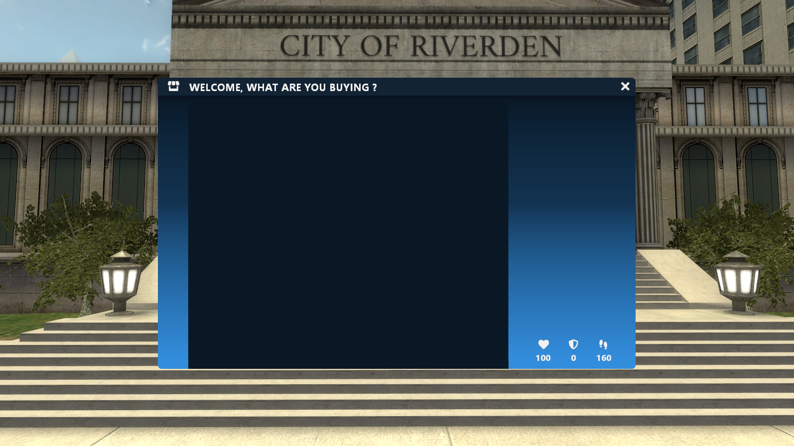

# Main UI Functions

### AAS.BaseMenu(title, info, sizeX, icon)
Draw the base menu


The icon must be the key of the material in the **AAS.Materials** table


| Types | Arguments | Descriptions | Optional |
| :--- | :--- | :--- | :--- |
| [string](https://www.lua.org/pil/2.4.html) | **title** | The title of the frame | ❌ |
| [boolean](https://www.lua.org/pil/2.2.html) | **info** | If the player information should be drawn | ❌ |
| [number](https://www.lua.org/pil/2.3.html) | **sizeX** | The width of right gradient | ❌ |
| [string](https://www.lua.org/pil/2.4.html) | **icon** | The menu icon | ❌ |


After call this function, you can get the menu with the **accessoriesFrame** variable


Example: 
```lua
AAS.BaseMenu(AAS.Language[AAS.Lang]["welcomeText"], true, 200, "house")
```

Output: 

