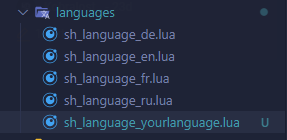

# Add a language


Firstly you need to take the english file on gmodstore




```lua
-- Thirdly you need to copy/past the entire english file into your language file
-- Next that you just have to translate all sentence.

AAS.Language["example"] = {
    ["cancel"] = "Cancel",
    ["save"] = "Save Item",
    ["name"] = "Name",
    ["model"] = "Model",
    ...   
}
```

